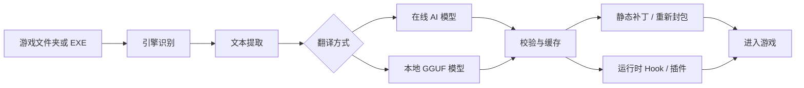

  <h1>EngAixt</h1>
  
<strong>AI 游戏翻译与运行时兼容工具</strong>

  
识别引擎 · 提取文本 · AI 翻译 · 写回游戏

  

    
    
    
  

EngAixt 不是屏幕 OCR。译文会进入游戏自己的对话框、菜单和道具说明，并尽量保留原有排版、控制符和占位符。

## 功能支持

- 自动识别常见游戏引擎和资源类型。
- 批量提取、翻译和回写游戏文本。
- 尽量保留角色名、控制符、占位符、换行和原有格式。
- 支持并发翻译、失败重试、翻译缓存、断点继续和结果校验。
- 根据引擎生成汉化补丁、重新封包，或部署运行时翻译。
- 提供日志、诊断报告，以及对 EngAixt 自己生成文件的卸载和恢复功能。

EngAixt 是翻译工作流和引擎兼容层，不是万能解包器。不同游戏的引擎版本、资源格式和保护方式不同，实际支持程度也会不同。

## 支持的引擎

| 引擎 | 主要方式 |
| - | - |
| RPG Maker（XP / VX / VX Ace / MV / MZ） | 静态提取与回写 |
| Unity | 运行时注入；部分资源支持静态处理 |
| Ren'Py | 静态提取与回写 |
| BGI / Ethornell | 静态提取与回写 |
| KiriKiri / 吉里吉里 | 运行时 Hook；实验性静态 XP3 回写 |
| Wolf RPG / Wolf RPG Pro | 静态提取与回写 |
| Godot | 静态处理；部分加密资源使用运行时方案 |
| GameMaker | 运行时翻译 |
| Unreal Engine | 静态文本资源处理 |
| TyranoScript / TyranoBuilder | 静态提取与回写 |

RPG Maker、Unity 和 Ren'Py 的覆盖相对稳定。KiriKiri、Wolf、BGI 和 Godot 仍在扩大覆盖范围；Unreal 和 GameMaker 目前只覆盖部分游戏。KiriKiri 默认使用运行时 Hook，静态 XP3 补丁需要手动启用，并且仍属于实验性功能。

## AI 翻译模型

### 在线模型

支持以下模型平台：

- DeepSeek
- 通义千问 Qwen
- 智谱 GLM
- Moonshot / Kimi
- 豆包 / 火山方舟
- OpenAI GPT
- Anthropic Claude

在线翻译需要用户自行配置对应平台的 API Key。请求由 EngAixt 直接发送到所选模型服务，不经过 EngAixt 服务器。

### 本地模型

支持完全离线翻译：

| 模型 | 量化版本 | 说明 |
| - | - | - |
| Hy-MT2 1.8B | Q4_K_M | 占用较低，适合实时翻译 |
| Hy-MT2 7B | Q4_K_M / Q8_0 | 更高质量，需要更多显存 |
| EngAixt-7B | Q4_K_M | 针对游戏翻译微调，控制符保留能力更好 |

本地模型通过 `llama.cpp` 运行。EngAixt-7B 模型可从 [ModelScope](https://www.modelscope.cn/models/ENGAOXT/EngAixt-7B-GGUF) 获取。任意 `.gguf` 文件选择功能目前尚未提供。

## 使用方式

Windows 10 / 11 x64 用户下载官方发布包，解压后运行 `EngAixt.exe`，不需要安装 Python 或配置开发环境。

项目完全免费，不提供游戏本体，也不经过 EngAixt 服务器中转翻译请求。部分引擎需要 GARbro、BepInEx、Frida 等外部组件，官方发布包会按支持范围提供所需运行文件。

## 开源工具

项目使用或集成了以下开源项目：

- **GARbro、KirikiriTools、msg_tool**：KiriKiri / XP3 资源处理
- **RPGMakerDecrypter、rpgmad**：RPG Maker 资源处理
- **UberWolf**：Wolf RPG 资源处理
- **UnityPy、AssetRipper**：Unity 资源处理
- **GDRE Tools、GDSDECOMP**：Godot 资源处理
- **unrpa、unrpyc**：Ren'Py 资源处理
- **UnrealPak、FModel**：Unreal 资源处理
- **Frida、BepInEx、XUnity.AutoTranslator**：运行时注入和翻译
- 部分引擎适配器、文本处理逻辑和原生运行时代码由 EngAixt 自行实现

完整许可信息见 [`THIRD_PARTY_NOTICES.md`](THIRD_PARTY_NOTICES.md)。第三方工具的二进制文件主要在官方发布包中提供，源码仓库不包含所有外部工具。

## 使用边界

EngAixt 面向用户本机已安装的离线单机游戏，不用于：

- 联网游戏、竞技游戏或带反作弊的游戏
- 绕过反作弊、账号验证、授权、DRM 或付费校验
- 提供密钥、破解工具或解密后的受保护资源
- 分发游戏原始资源或修改后的游戏内容

遇到兼容性问题时，请先在软件中生成诊断报告，再附上相关日志反馈。诊断报告会过滤 API Key 等敏感配置。

## 许可证

本项目采用 GPLv3，详见 [`LICENSE`](LICENSE)。
